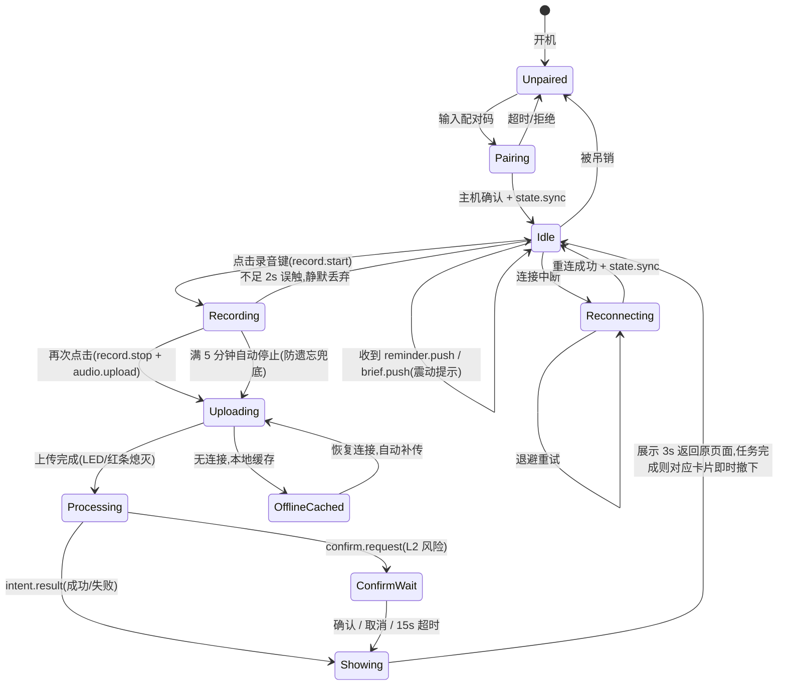
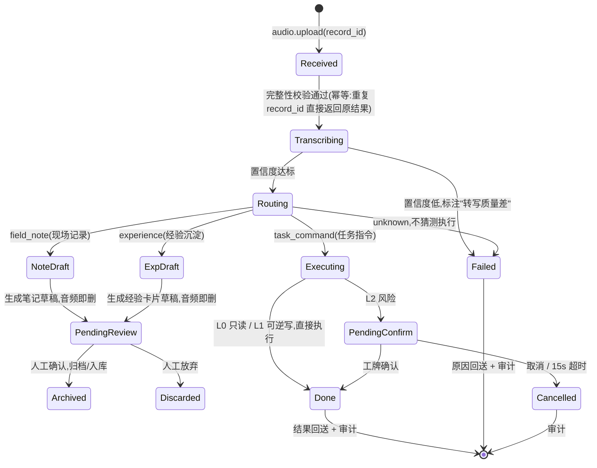
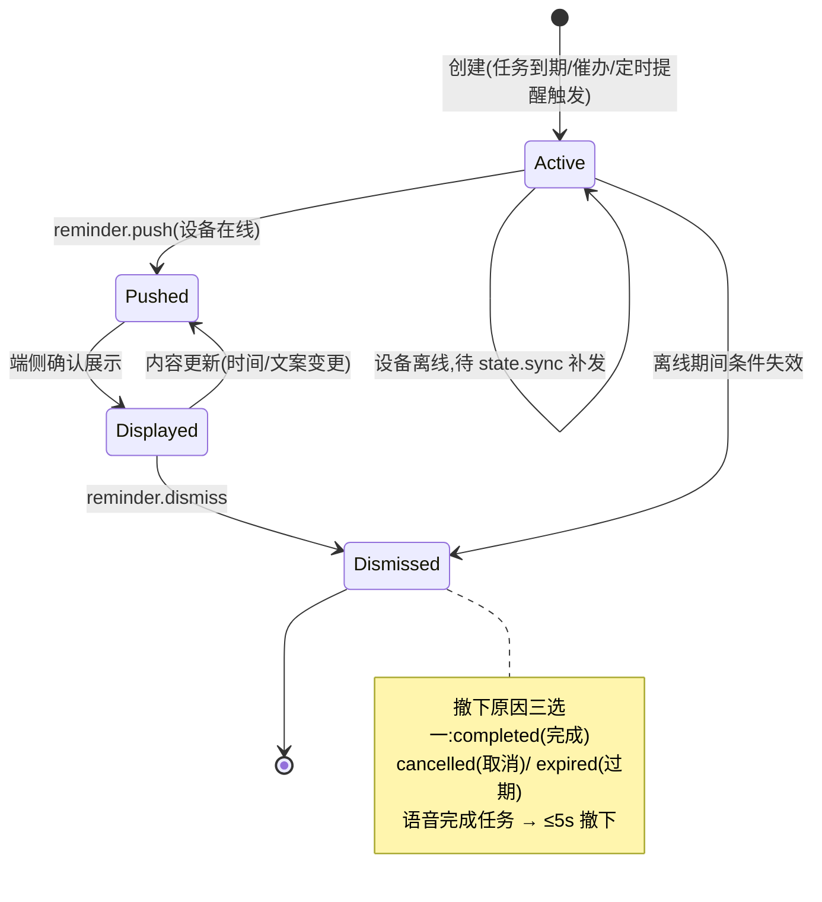

# AI 工牌 — 08 架构设计

| 项 | 内容 |
|---|---|
| 版本 | v1.0 |
| 效力层级 | 03 宪法 > 01/02 需求 > 04 规约 > **本文档** > 实现 |
| 范围 | Agent 软件工程设计:状态机、模块划分、数据表、目录结构。汇报用简版见 `07-架构总览.md` |

---

## 1. 状态设计

系统有三个核心状态机:端侧运行时(工牌/虚拟工牌)、主机侧录音处理管线、提醒卡片生命周期。确认回路内嵌于管线,不单独成图。

### 1.1 端侧运行时状态机(工牌固件 / 虚拟工牌共用语义)



要点:任何状态下连接中断都不丢已录音频(OfflineCached);`state.sync` 是重连后恢复卡片与状态的唯一入口。

### 1.2 主机侧录音处理管线



### 1.3 提醒卡片生命周期



---

## 2. 模块划分(Agent 主机)

| 模块 | 职责 | 关键接口 | 关联 FR |
|---|---|---|---|
| `gateway` | 设备接入:WS 连接管理、配对/吊销、心跳重连、协议编解码 | `on_message()` / `push(device_id, msg)` / `pair()` / `revoke()` | FR-01 |
| `audio` | 音频管线:HTTP 接收、完整性校验、临时存储、转写后清理 | `receive_upload()` / `cleanup(record_id)` | FR-02 |
| `router` | 意图路由:LLM 分类 + 规则兜底 + 显式模式优先 | `route(transcript, mode) → Intent` | FR-04 |
| `skills.field_note` | 现场记录:结构化笔记草稿、待确认队列、归档 | `process(record) → Draft` | FR-05 |
| `skills.briefing` | 每日简报:定时/补发生成、条目来源追溯 | `generate(date) → Briefing` | FR-06 |
| `skills.reminder` | 提醒调度:卡片生命周期、到期触发、"说完即消" | `sync_cards()` / `dismiss(task_id)` | FR-07 |
| `skills.task_command` | 语音指令:参数抽取、歧义候选、幂等执行 | `execute(intent, record_id) → Result` | FR-08 |
| `skills.experience` | 经验沉淀 D1/D2:卡片草稿、入库、检索引用 | `process(record)` / `extract(doc)` | FR-10 |
| `security` | 安全层:白名单、风险分级(L0/L1/L2)、确认回路编排 | `check(intent) → RiskLevel` / `request_confirm()` | FR-09 |
| `audit` | 审计:append-only 日志、导出 | `log(event)` / `export(range)` | FR-11 |
| `adapters.llm` | LLM 调用抽象:provider 可切换、JSON schema 校验、脱敏开关 | `complete(prompt, schema)` | 宪法第 3/7 条 |
| `adapters.asr` | ASR 抽象:faster-whisper / FunASR / 企业服务 | `transcribe(audio) → {text, confidence}` | FR-03 |
| `adapters.task` / `calendar` / `notes` | 办公系统抽象:Mock 实现先行,真实实现后插 | `list/add/complete/...` | FR-06/08 |
| `store` | 持久化:SQLite repo + Markdown 文件存储 | 各 repo 类 | 全部 |
| `scheduler` | 定时:简报生成、提醒到期扫描 | cron/interval | FR-06/07 |
| `api` | HTTP/WS 端点装配、静态托管虚拟工牌 | FastAPI app | FR-12 |
| `cli` | 启动/配对/日志导出/Mock 数据导入 | `agent-host <cmd>` | FR-13 |

依赖方向(禁止反向):`api/cli → gateway/skills → security/audit → adapters/store`。`skills` 不得直接 import 外部 SDK(宪法第 7 条);`router` 只经 `adapters.llm` 调模型。

虚拟工牌(frontend)模块:`protocol`(消息类型,与登记册同源)/ `state`(§1.1 状态机实现)/ `stores`(连接、卡片)/ `views`(Identity/Cards/Recording/Confirm)/ `lib`(ws-client、recorder、haptics)。初期不引入 vue-router/Pinia。

---

## 3. 数据表设计(SQLite)

原则:结构化状态入库;笔记与经验卡片正文存 Markdown 文件(`data/notes/`、`data/experience/`),库内只留索引与草稿;`audit_log` 只增不改(应用层不提供 UPDATE/DELETE);音频转写后即删,`records.audio_tmp_path` 置 NULL。

| 表 | 字段(类型,约束) | 说明 |
|---|---|---|
| `devices` | id TEXT PK;name TEXT;token_hash TEXT NOT NULL;paired_at TEXT;revoked_at TEXT NULL;last_seen_at TEXT | 配对设备;吊销即 revoked_at 非空,token 立即失效(FR-01) |
| `records` | id TEXT PK(record_id);device_id TEXT FK;mode TEXT('auto'\|'field'\|'experience');started_at TEXT;duration_ms INT;audio_tmp_path TEXT NULL;status TEXT;transcript TEXT NULL;confidence REAL NULL;intent TEXT NULL;created_at TEXT | 一次录音的管线状态;transcript 本地留存,audio 即删(宪法第 3 条) |
| `tasks` | id TEXT PK;source TEXT('mock'\|adapter 名);source_id TEXT NULL;title TEXT;status TEXT('open'\|'done');due_at TEXT NULL;completed_via TEXT NULL('voice'\|'pc');created_at;updated_at | 任务;真实系统接入后 source/source_id 做外部映射 |
| `calendar_events` | id TEXT PK;source TEXT;source_id TEXT NULL;title TEXT;start_at TEXT;end_at TEXT;location TEXT NULL | 日历事件(简报数据源) |
| `cards` | id TEXT PK;kind TEXT('task'\|'timer');ref_task_id TEXT NULL FK;title TEXT;body TEXT NULL;status TEXT('active'\|'dismissed');dismiss_reason TEXT NULL('completed'\|'cancelled'\|'expired');remind_at TEXT NULL;created_at;updated_at | 提醒卡片,仅两类(宪法第 4 条);生命周期见 §1.3 |
| `briefings` | id INTEGER PK;date TEXT;content_json TEXT(条目含来源 task/event id);generated_at TEXT;pushed_at TEXT NULL | 每日简报;条目级来源可追溯(FR-06 验收) |
| `drafts` | id TEXT PK;record_id TEXT NULL FK;kind TEXT('note'\|'experience');content_md TEXT;status TEXT('pending'\|'confirmed'\|'discarded');file_path TEXT NULL;created_at;confirmed_at TEXT NULL | 待人工确认的草稿(宪法第 8 条);确认后正文落 Markdown,file_path 记录路径 |
| `experience_index` | id TEXT PK;title TEXT;domain TEXT;file_path TEXT;status TEXT('draft'\|'active');source TEXT('voice'\|'doc');created_at | 经验卡片索引,供检索引用(FR-10) |
| `audit_log` | id INTEGER PK AUTOINCREMENT;ts TEXT;device_id TEXT;record_id TEXT NULL;intent TEXT NULL;risk_level TEXT('L0'\|'L1'\|'L2') NULL;tool TEXT NULL;params_json TEXT NULL;decision TEXT('executed'\|'confirmed'\|'cancelled'\|'timeout'\|'failed');result TEXT NULL;extra_json TEXT NULL | append-only;转写文本只存截断/哈希(04 §8) |

幂等设计:`records.id` 即 `record_id`,指令执行前查 `records` + `audit_log`,重复上传直接返回首次结果(FR-08)。

---

## 4. 项目目录结构

```
office_agent/
├── docs/                        # 全部规约文档(01~08,按编号阅读)
│   └── protocol.md              # 协议登记册(A0-1 产出,唯一事实来源)
├── backend/                     # Agent 主机(Python 3.11+)
│   ├── pyproject.toml
│   ├── config.example.yaml      # 配置模板;真实 config.yaml gitignore
│   ├── src/agent_host/
│   │   ├── main.py              # 入口
│   │   ├── gateway/             # 设备接入层
│   │   ├── audio/               # 音频管线
│   │   ├── router/              # 意图路由
│   │   ├── skills/              # field_note/briefing/reminder/task_command/experience
│   │   ├── security/            # 白名单、风险分级、确认回路
│   │   ├── audit/               # append-only 审计
│   │   ├── adapters/            # llm/asr/task/calendar/notes(接口+Mock)
│   │   ├── store/               # SQLite repo + Markdown 存储
│   │   ├── scheduler/           # 简报定时、提醒到期
│   │   ├── api/                 # HTTP/WS 端点、静态托管
│   │   └── cli.py
│   └── tests/                   # pytest;用例命名带 FR 号(test_fr08_*.py)
├── frontend/                    # 虚拟工牌(Vue3 + Vite + TS + vite-plugin-pwa)
│   ├── package.json
│   ├── vite.config.ts
│   └── src/
│       ├── protocol/            # 消息类型(与 docs/protocol.md 对齐)
│       ├── state/               # 端侧状态机(§1.1)
│       ├── stores/              # 连接/卡片响应式 store
│       ├── views/               # Identity / Cards / Recording / Confirm
│       ├── lib/                 # ws-client / recorder / haptics
│       ├── App.vue
│       └── main.ts
├── data/                        # 运行时数据(gitignore;仅保留目录结构)
│   ├── agent.db
│   ├── notes/                   # 归档笔记(Markdown)
│   ├── experience/              # 经验卡片(Markdown)
│   └── audio_tmp/               # 音频临时区,转写后即清
├── testdata/                    # 黄金测试集(04 §5)
│   ├── l1_synthetic/            # 指令合成集(入库)
│   ├── l2_public/               # 公开访谈集:仅标注与链接入库,音频本地
│   ├── l3_asr_baseline/         # ASR 基线集:仅标注与链接入库
│   └── noise/                   # 噪声库
├── scripts/                     # 语料构建、开发辅助脚本
└── README.md                    # 新人 10 分钟跑通(04 §9)
```

gitignore 范围:`data/` 内容(保留 `.gitkeep`)、`config.yaml`、`testdata/l2_public|l3_asr_baseline` 的音频文件、`node_modules`、`__pycache__`、构建产物。

---

## 5. 与既有文档的关系

- 模块职责的需求来源:`02-Agent需求文档.md` §3.1;本文件是它的工程落地,两处不一致时以先修正文档为原则(宪法第 9 条)。
- 状态机的消息名称以 `docs/protocol.md`(A0-1 产出)为准;本文件图示用语义名,登记册定义字段级格式。
- 目录结构即 `04-开发规约.md` §9 交接约定的物理实现。

---

## 6. 显示契约(Display Contract)

端侧显示能力的硬性约束,**主机与端侧共同遵守**(效果图见 `docs/assets/eink-*.png`)。

**设计前提(Owner 决策,2026-07-20)**:
- **工牌外形与屏幕模组分离**:工牌外形固定 **60×90mm(宽×高,2:3),竖向佩戴**;400×300(4.2")与 296×128(2.9")仅为候选屏幕模组,模组外形不等于工牌外形,模组参数不等同最终交互布局。
- **全部 UI 以 Portrait 竖向排版**:文字、按钮、二维码均竖向默认;横置模组竖装时逻辑画布旋转 90°。仿真画布 A/B 统一 300×400(2026-07-20 修订:B 档 128×296 窄行宽多次折行,存在一屏显示不完风险,仿真期布局与 A 一致;2.9" 模组实物排版约束待 EVT 测绘后再评估)。
- 硬件 EVT 前允许用模组横排做显示评估,但不得作为最终布局依据。

### 6.1 页面模型(简报与提醒不堆叠)

| 页面 | 内容 | 进入/退出 |
|---|---|---|
| 默认页(常态) | 当前最高优先的待办/定时提醒(**单卡**);无卡时 A 档显示身份页(姓名/部门/二维码),B 档显示空态 | 常态;新卡到达即更新 |
| 简报页 | 今日简报(≤5 条) | 翻页键手动进入,再按翻页回默认页 |
| 录音页 | 静态"录音中" + "点击结束"(**无每秒计时刷新**) | 录音键进入,停止/自动停止退出 |
| 候选页(clarify) | 全屏确认任务选择 | 路由歧义进入,选定/取消退出 |
| 结果页 | 执行结果 | 短暂显示(≤3s)后**返回原页面**(默认页或简报页) |
| 确认页(L2) | 完整后果文案(不得截断) | confirm.request 进入,确认/取消/超时退出 |

### 6.2 刷新规则(逐状态)

| 状态/事件 | 刷新方式 | 说明 |
|---|---|---|
| 默认页无变更 | **不刷新** | 静态零功耗 |
| 新卡到达 / 卡片撤下 | 局刷 | 变更高频但每次只改局部 |
| 默认页 ↔ 简报页翻页 | 全刷 | 整页切换 |
| 录音开始 / 结束 | 局刷 | 即时反馈由 LED + 震动承担,屏为辅助 |
| 录音过程中 | **不刷新** | 静态页,取消每秒计时(Owner 决策);3 分钟提醒触发时局刷 1 次 |
| clarify / L2 确认页进入 | 全刷 | 全屏决策界面 |
| 结果页 | 局刷 | ≤3s 返回原页面 |
| 消残影 | 每 20 次局刷或每日 1 次全刷 | 空闲时段(01 §5.2.1) |

### 6.3 画布与排版(竖向)

**仿真期约定(2026-07-20)**:A/B 仿真画布统一 300×400 竖向,布局评估以 A 列为准;B 列数值为 2.9" 296×128 模组实物约束,待 EVT 实物测绘后生效。

| 项 | Profile A(300×400 竖) | Profile B(128×296 竖) |
|---|---|---|
| 对应模组 | 4.2" 400×300 模组竖装(候选) | 2.9" 296×128 模组竖装(候选) |
| 行宽(正文 16px) | ~18 字 | **~8 字**(极限,见 §6.5 文案特化) |
| 可用行数 | ~17 行 | ~12 行 |
| 字号阶梯 | 状态栏 12 / 正文 16 / 标题 20 | 状态栏 10~12 / 正文 16 / 标题 18 |
| 卡片标题 | ≤16 字 | ≤8 字/行,可两行 |
| 卡片正文 | ≤4 行 × 18 字 | ≤6 行 × 8 字 |
| 简报 | ≤5 条,单页 | ≤3 条/页 |
| clarify 候选 | ≤3 个/页 | ≤2 个/页 |
| 二维码 | ≤160×160 | ✗(行宽不足) |
| 共同约束 | 纯黑白(#000/#fff);禁灰阶/渐变/阴影/动画;圆角 ≤2px;录音指示红条语义归硬件独立 LED,屏上仅纯黑静态标识 | 同左 |

### 6.4 按键映射

| 键 | 短按 | 长按(预留) |
|---|---|---|
| 录音键 | idle:开始录音(record.start);recording:结束(record.stop + 上传) | — |
| 确认/返回键 | 默认页/简报页:翻页;confirm_wait:确认;clarify:选定当前候选;结果页:立即返回 | 取消 / 回默认页 |

clarify 候选逐页呈现时,确认键短按循环移动焦点、长按选定(原型期以触控/点击模拟)。
方案 B 的按键数量与位置待录音卡实物测绘(01 §5.3.1),映射语义不变。
屏幕不承载录音主按钮:开始/结束由实体录音键承担,屏上只显示录音状态(PWA 演示端的屏幕按钮是触控替身)。

### 6.5 主机侧约束

- 主机按端侧声明的 `display_profile` 档位截断内容(**超出截断由主机负责**),端侧不做复杂排版。
- B 档竖屏行宽仅 ~8 字:任务名、卡片刻意短句化由主机文案特化(如"周报撰写截止"优于"请于今天 18:00 前提交周报");长文案任务名须有短名映射。
- 截断不得破坏语义:**L2 确认文案不得截断**——按 Profile B 竖屏 ≤6 行 × 8 字校核,超出时主机改写而非截断。
