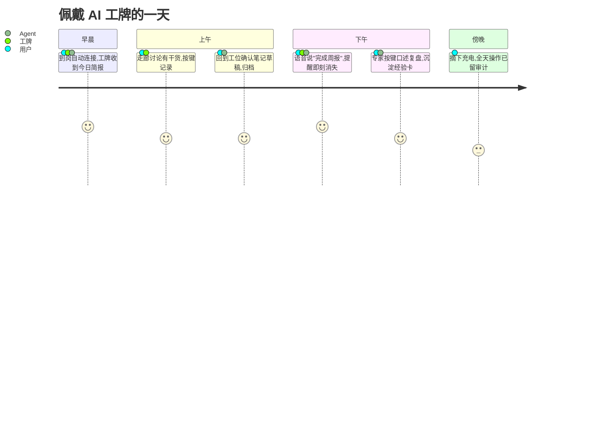
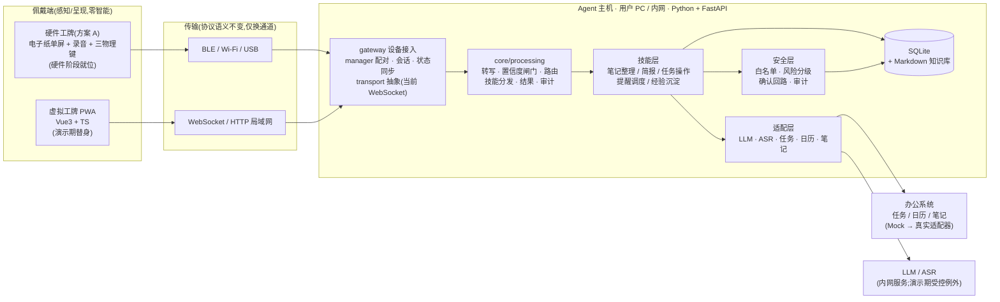
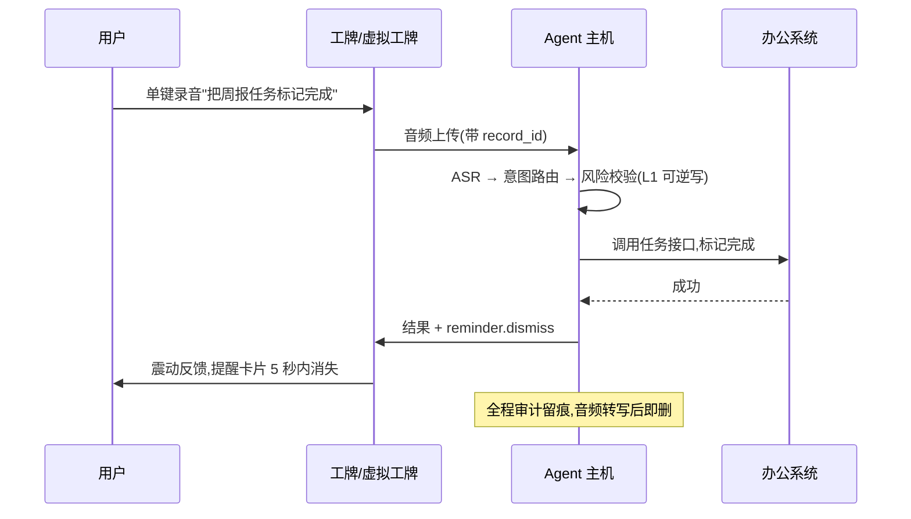

# AI 工牌 — 06 架构总览(汇报版)

| 项 | 内容 |
|---|---|
| 文档集版本 | v2.0(文档基线版本,非软件产品版本) |
| 文档状态 | 候选基线(未经 Owner 与 Codex 评审,暂不生效) |
| 生效日期 | 评审通过后确定 |
| 权威范围 | 本文档为汇报版一页总览,不参与效力裁定;权威结论以 `01-项目与硬件需求.md`、`02-Agent软件需求.md` 为准,红线与规约见 `03-项目宪法.md`、`04-开发规约.md`,工程设计见 `07-架构设计.md` |

## 1. 一句话定位

AI 工牌是办公场景的 **Agent 物理入口**:工牌负责"按下说、抬眼看",识别、推理、系统操作全部在用户 PC/企业内网完成——佩戴设备零智能、零凭据,丢失零风险。

## 2. 用户旅程(一天)

## 3. 总体架构

**三条架构红线**(宪法):端侧不跑智能、不存凭据;录音必须按键触发;一切外部调用经安全层与适配层。

## 4. 核心闭环:语音指令"说完即消"

高风险操作(不可逆/影响他人)多一步:工牌显示后果文案 → 用户实体键确认 → 才执行;15 秒无操作自动取消。

## 5. 输入 → 处理 → 输出

| 输入 | 处理(PC/内网) | 输出 |
|---|---|---|
| 按键语音:现场记录 / 办公指令 / 经验复盘 | ASR → 置信度闸门 → 意图路由 → 风险校验 → 技能执行(core/processing 单入口) | 工牌:简报、提醒卡片、执行结果、确认请求 |
| 已授权的日历、任务数据(适配层) | 定时生成简报、到期/催办提醒 | PC:笔记草稿、任务变更(均待人工确认) |
| 存量文档(场景 4-D2,后期) | 结构化提取 → 人工确认 | 经验卡片库(Markdown,可被 Agent 引用);全量审计日志 |

## 6. 技术栈

| 层 | 选型 | 说明 |
|---|---|---|
| 佩戴端(演示期) | Vue3 + Vite + TypeScript + PWA | 旧 Android 机/模拟器浏览器即用,零安装 |
| 佩戴端(硬件期) | 电子纸单屏 + 录音 + 三物理键(方案 A) | 协议与演示期完全一致,仅换 Transport 实现 |
| Agent 主机 | Python 3.11 + FastAPI + SQLite | 单进程;核心层(含 core/processing)不依赖 Web 框架;技能层自研,不用重型 Agent 框架 |
| AI 能力 | faster-whisper(ASR)+ LLM provider 抽象 | 内网部署;演示期第三方 API 为受控例外(脱敏+审计) |
| 协议 | WebSocket + HTTP(语义层)→ 硬件期映射 BLE/Wi-Fi/USB | 协议登记册(08)为唯一事实来源 |
| 知识沉淀 | Markdown 笔记/经验卡片库 | 人可读、可被 Agent 检索引用 |

## 7. 演进路径

1. **软件主线**:A0 规约与原型 → A1 核心闭环 → A2 全场景 → A3 硬件接入准备(按需)——虚拟工牌 + Mock 办公系统跑通场景,产出 Agent v1.0(任务卡与验收见 05)。
2. **硬件接入(按需)**:固件按同一套协议实现,传输层换成 Transport 新实现(BLE/Wi-Fi/USB);虚拟工牌降级为测试工具,协议级测试套件直接复用。
3. **试点**:Mock 适配器逐个替换为真实企业系统;经验卡片库开始积累,形成领域 skill。

## 8. 合规设计(给评审的一页)

- 录音:仅按键触发(单键切换)+ 录音指示(硬件 LED 与录音电路联动);原始音频转写后即删
- 数据:文本留存本机/内网;演示期第三方模型调用需显式开启 + 脱敏 + 审计标记
- 操作:有风险操作必须物理确认;全量操作 append-only 审计日志,可复盘每一次执行
