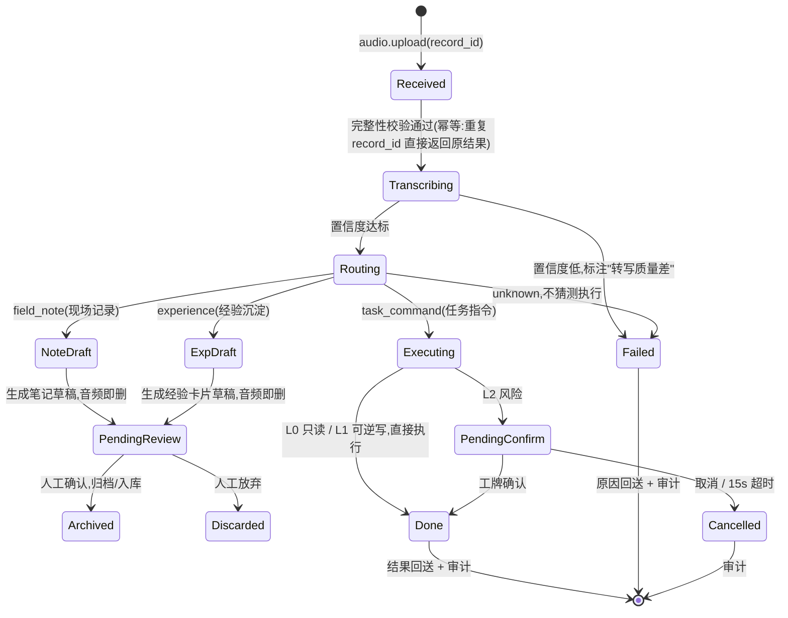
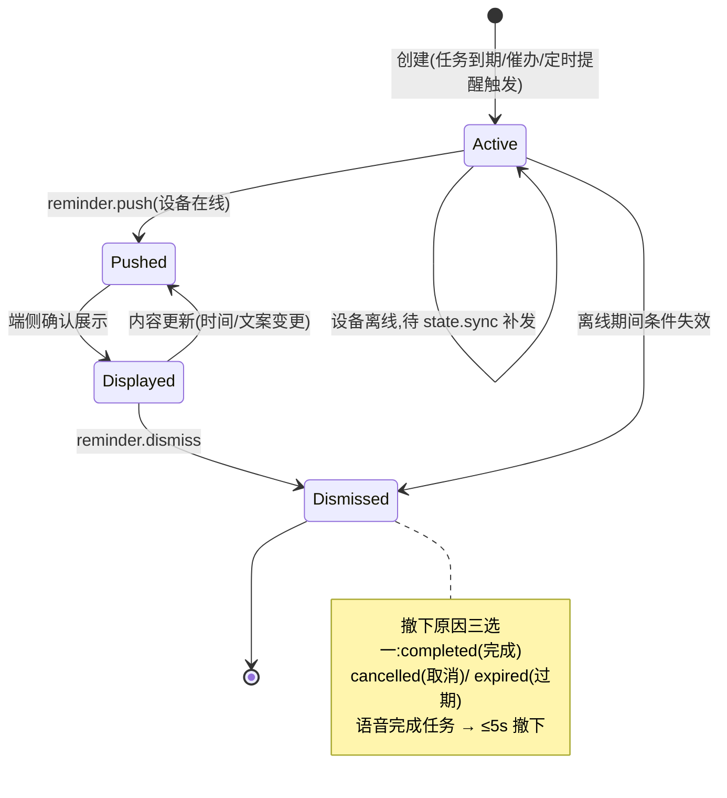

# AI 工牌 — 07 架构设计

| 项 | 内容 |
|---|---|
| 文档集版本 | v2.0(文档基线版本,非软件产品版本) |
| 文档状态 | 候选基线(未经 Owner 与 Codex 评审,暂不生效) |
| 生效日期 | 评审通过后确定 |
| 权威范围 | 本文档管 Agent 软件工程设计:状态机、模块划分、数据表、目录结构、显示契约;汇报用简版见 `06-架构总览.md`;协议字段级定义见 `08-端云协议.md` |
| 效力层级 | 03 宪法 > 01/02 需求 > 04 规约 > **本文档** > 实现 |

---

## 1. 状态设计

系统有三个核心状态机:端侧运行时(工牌/虚拟工牌)、主机侧录音处理管线、提醒卡片生命周期。确认回路内嵌于管线,不单独成图。

### 1.1 端侧运行时状态机(工牌固件 / 虚拟工牌共用语义)

```mermaid
stateDiagram-v2
  [*] --> Unpaired: 开机
  Unpaired --> Pairing: 输入配对码
  Pairing --> Idle: 主机确认 + state.sync
  Pairing --> Unpaired: 超时/拒绝
  Idle --> Recording: 点击录音键(record.start)
  Recording --> Uploading: 再次点击(record.stop + audio.upload)
  Recording --> Uploading: 满 5 分钟自动停止(防遗忘兜底)
  Recording --> Idle: 不足 2s 误触,静默丢弃
  Uploading --> Processing: 上传完成(LED/红条熄灭)
  Uploading --> Showing: intent.result 先于响应到达(时序等价)
  Uploading --> ConfirmWait: confirm.request 先于响应到达(时序等价)
  Uploading --> OfflineCached: 无连接,本地缓存
  OfflineCached --> Uploading: 恢复连接,自动补传
  Processing --> Showing: intent.result(成功/失败)
  Processing --> ConfirmWait: confirm.request(L2 风险)
  ConfirmWait --> Showing: 确认 / 取消 / 15s 超时
  Showing --> Idle: 成功 3s 自动返回原页面,失败/未听清停留至点击返回;任务完成则对应卡片即时撤下
  Idle --> Idle: 收到 reminder.push / brief.push(震动提示)
  Idle --> Reconnecting: 连接中断
  Reconnecting --> Idle: 重连成功 + state.sync
  Reconnecting --> Reconnecting: 退避重试
  Idle --> Unpaired: 被吊销
```



要点:

- 任何状态下连接中断都不丢已录音频(OfflineCached);`state.sync` 是重连后恢复卡片与状态的唯一入口。
- 时序等价(A1-2 实测修复):`intent.result`/`confirm.request` 可能经 WS 先于 HTTP 200 到达(如 duplicate 补推)——两种到达顺序收敛到同一终态;晚到的 `UploadDone` 在 Showing/ConfirmWait 无迁移,不得覆盖。
- 上传被主机拒绝(HTTP 非 200 且非网络失败,如 4xx 永久拒绝):端侧本地补充迁移 Uploading → Idle,即时移除恢复凭据(图未列此分支,端侧实现见 `frontend/src/state/machine.ts` 的 `UploadRejected`)。
- 按键语义统一:触发本状态机的按键事件一律来自 `pressKey(action|page_up|page_down, gesture)`(见 §6.4 与 09 §2),状态机与业务不区分事件来源(虚拟物理键/演示按钮/未来 GPIO)。

实现参照:`frontend/src/state/machine.ts`(10 态 18 事件,迁移表与上图逐边对应)。

### 1.2 主机侧录音处理管线



本管线即 `core/processing` 的核心流程("转写文本 → 置信度闸门 → 路由 → 技能分发 → 结果 → 审计",见 §2),设备录音/PC 文字/PC 录音/音频文件共用此文本入口(`process_text`;core 零推送,音频接收/转写/清理与统一投递在 `api/app.py` 装配层)。

### 1.3 提醒卡片生命周期



---

## 2. 模块划分(Agent 主机)

### 2.1 分层定界(v2.0 校准结论)

- **核心层不依赖 Web 框架**:`router` / `skills` / `security` / `audit` / `store` / `adapters` / `scheduler` / `core` 不得 import FastAPI/Starlette;Web 框架只允许出现在 `api` 与 `gateway/transport` 边界(规约 §4)。
- **核心流程单入口**:`core/processing` 承载"转写文本 → 置信度闸门 → 路由 → 技能分发 → 结果 → 审计"核心流程;设备录音/PC 文字/PC 录音/音频文件**共用此流程**,禁止旁路。
- **gateway 内部分工**:`gateway/transport` 定义 Transport 抽象(`accept` / `receive_text` / `send_text` / `close`),WebSocketTransport 为当前唯一实现,未来 BLE/Wi-Fi/USB 实现同一接口(契约见 09 §3);`gateway/manager` 只管设备身份/配对/会话/状态同步/协议语义,**不碰传输 API**。
- **分层定界(对外)**:Agent API(`/desk/*`、`/audio` 等)面向 PC、CLI 与未来软件集成;设备协议(WS)只管虚拟/实体工牌的事件、状态与结果展示;当前不引入 MQTT,不实现 BLE(09 §4)。

**装配关系**:`api/app.py` 仅做装配(构建 `ProcessingDeps`、音频编排[取行/转写/清理]、统一投递 `_deliver`),核心流程全部在 `core/processing.py`(零推送,返回 `ProcessOutcome`);`gateway/manager.py` 只依赖 Transport 抽象,FastAPI WebSocket 仅由 `gateway/transport.py` 的 `WebSocketTransport` 包装(分层由 `tests/test_arch_boundaries.py` 守卫)。

**投递韧性与连接守卫**:核心流程在返回 `ProcessOutcome` 之前完成终态落库、结果缓存(duplicate 补推)与审计;统一投递经 `push`/`broadcast` 发送,捕获 `TransportClosed` 按离线跳过——**投递失败不影响终态/缓存/审计**。**会话唯一**:同 `device_id` 仅一个活动会话,hello 认证成功即退休旧连接(服务端关闭);旧连接之后发来的 record.start / clarify.select / confirm.response / state.sync.request 等消息**整条忽略**(活动性守卫,不 ack、不分发、无业务效果);旧连接迟到退出经 finally 身份守卫(仅登记仍指向本连接时才清理),**不清除新连接的登记与 capabilities**。capabilities 绑定当前连接:每次 hello 必替换快照(未携带 → 清除),推送发现当前连接失效时同步清理。

### 2.2 模块表

| 模块 | 职责 | 关键接口 | 关联 FR |
|---|---|---|---|
| `gateway.manager` | 设备身份、配对/吊销、会话、状态同步、协议语义分发 | `handle_connection()` / `on_message()` / `push()` / `broadcast()` / `approve_pair()` / `revoke()` | FR-01 |
| `gateway.transport` | Transport 抽象与 WebSocket 实现(v2.0 校准新增;FastAPI 唯一包装点) | `accept()` / `receive_text()` / `send_text()` / `close()` | FR-01 |
| `gateway.envelope` | 消息信封构造(与 08 §1.2 一致) | `make_envelope()` | 全部 |
| `core.processing` | 核心流程单入口:转写文本 → 置信度闸门 → 路由 → 技能分发 → 结果 → 审计;**来源中立**——record_id 缺省时按 source + 可空 device_id 真实登记(不伪造设备/录音记录),device_id 仅为可选来源信息;零推送,`ProcessOutcome` 只含 record_id + 消息序列,**投递目标由外层适配器决定**;音频接收/转写/清理在 core 外(`api/app.py` 装配层编排),统一投递 `_deliver` 在 app 装配层 | `process_text()` / `record_asr_failure()` / `on_clarify()` | FR-02~05/08 |
| `audio` | 音频管线:HTTP 接收、完整性校验、临时存储、转写后清理 | `save_upload()` / `transcribe_file()` / `cleanup(record_id)` | FR-02 |
| `router` | 意图路由:LLM 分类 + 规则兜底 + 显式模式优先(LLM 低置信 → unknown 反问;异常/非法输出回退规则;指令名限白名单;第三方 LLM **运行时接入暂停**(宪法第 3 条,脱敏/出域审计未就绪),运行时纯规则,provider 仅供验收测试) | `route(transcript, mode) → Intent` | FR-04 |
| `skills.field_note` | 现场记录:结构化笔记草稿、待确认队列、归档(归档未实现) | `process(record_id, transcript)` / `archive(draft_id)` | FR-05 |
| `skills.briefing` | 每日简报:定时/补发生成、条目来源追溯(生成未实现) | `generate(date) → Briefing` | FR-06 |
| `skills.reminder` | 提醒调度:一次性定时提醒解析/创建/确认、卡片生命周期 | `execute()` / `confirm_pending()` | FR-07 |
| `skills.task_command` | 语音指令:参数抽取、歧义候选、幂等执行、多任务预览 | `execute(intent, record_id) → Result` | FR-08 |
| `skills.experience` | 经验沉淀 D1/D2:卡片草稿、入库、检索引用(D2 未实现) | `process(record_id, transcript)` / `extract(doc)` | FR-10 |
| `security` | 安全层:白名单、风险分级(L0/L1/L2)、确认回路编排(骨架) | `check(intent) → RiskLevel` / `request_confirm()` | FR-09 |
| `audit` | 审计:append-only 日志、导出 | `log(event)` / `export(range)` | FR-11 |
| `adapters.llm` | LLM 调用抽象:provider 可切换、JSON schema 校验、脱敏开关 | `complete(prompt, schema)` | 宪法第 3/7 条 |
| `adapters.asr` | ASR 抽象:faster-whisper / FunASR / 企业服务 | `transcribe(audio) → {text, confidence}` | FR-03 |
| `adapters.task` / `calendar` / `notes` | 办公系统抽象:Mock 实现先行,真实实现后插 | `list/add/complete/...` | FR-06/08 |
| `store` | 持久化:SQLite repo + Markdown 文件存储 | 各 repo 类 | 全部 |
| `scheduler` | 定时:提醒到期扫描(30s 广播到期 timer 卡;触发记录仅内存,重启后过期未撤卡补触发一次);简报定时生成留后续任务卡 | `fire_due()` / `reminder_loop()` | FR-06/07 |
| `api` | HTTP/WS 端点装配、静态托管虚拟工牌;`/desk/*` 本机工作台接口(只读 + 完成/取消/配对批准);核心流程装配:构建 `ProcessingDeps`、音频编排(取行/转写/清理)、统一投递 `_deliver` | FastAPI app | FR-12 |
| `cli` | 启动/配对/日志导出/Mock 数据导入 | `agent-host <cmd>` | FR-13 |

依赖方向(禁止反向):`api/cli → gateway(manager)/core → skills → security/audit → adapters/store`。`skills` 不得直接 import 外部 SDK(宪法第 7 条);`router` 只经 `adapters.llm` 调模型。

虚拟工牌(frontend)模块:`protocol`(消息类型,与登记册同源)/ `state`(§1.1 状态机实现)/ `stores`(connection、cards、ui)/ `views`(Identity/Cards/Recording/Confirm/Desk)/ `lib`(device-input[pressKey 输入语义]、ws-client、recorder、recording、pending-audio、haptics)。不引入 vue-router/Pinia。

---

## 3. 数据表设计(SQLite,9 表)

原则:结构化状态入库;笔记与经验卡片正文存 Markdown 文件(`data/notes/`、`data/experience/`),库内只留索引与草稿;`audit_log` 只增不改(应用层不提供 UPDATE/DELETE);音频转写后即删,`records.audio_tmp_path` 置 NULL。权威定义见 `backend/schema.sql`,本节为说明性对齐。

| 表 | 字段(类型,约束) | 说明 |
|---|---|---|
| `devices` | id TEXT PK;name TEXT NOT NULL;token_hash TEXT NOT NULL;paired_at TEXT NOT NULL;revoked_at TEXT NULL;last_seen_at TEXT | 配对设备;吊销即 revoked_at 非空,token 立即失效(FR-01) |
| `records` | id TEXT PK(record_id);device_id TEXT NULL FK(来源设备,PC 文字等无设备来源为 NULL);source TEXT NOT NULL DEFAULT 'device_audio'(来源类型:device_audio/pc_audio/audio_file/pc_text);mode TEXT CHECK('auto'\|'field'\|'experience');started_at TEXT NOT NULL;duration_ms INT NOT NULL;audio_tmp_path TEXT NULL;status TEXT CHECK('uploaded'\|'transcribed'\|'routed'\|'done'\|'failed');transcript TEXT NULL;confidence REAL NULL;intent TEXT NULL;created_at TEXT NOT NULL | 一次输入的管线状态;transcript 本地留存,audio 即删(宪法第 3 条) |
| `tasks` | id TEXT PK;source TEXT DEFAULT 'mock';source_id TEXT NULL;title TEXT NOT NULL;status TEXT DEFAULT 'open' CHECK('open'\|'done');due_at TEXT NULL;completed_via TEXT NULL CHECK('voice'\|'pc');created_at;updated_at | 任务;真实系统接入后 source/source_id 做外部映射 |
| `calendar_events` | id TEXT PK;source TEXT DEFAULT 'mock';source_id TEXT NULL;title TEXT NOT NULL;start_at TEXT NOT NULL;end_at TEXT NOT NULL;location TEXT NULL | 日历事件(简报数据源) |
| `cards` | id TEXT PK;kind TEXT CHECK('task'\|'timer');ref_task_id TEXT NULL FK;title TEXT NOT NULL;body TEXT NULL;status TEXT DEFAULT 'active' CHECK('active'\|'dismissed');dismiss_reason TEXT NULL CHECK('completed'\|'cancelled'\|'expired');remind_at TEXT NULL;created_at;updated_at;索引 idx_cards_status | 提醒卡片,仅两类(宪法第 4 条);ref_task_id 关联任务(端侧勾选完成用);生命周期见 §1.3 |
| `briefings` | id INTEGER PK AUTOINCREMENT;date TEXT NOT NULL;content_json TEXT NOT NULL(条目含来源 task/event id);generated_at TEXT NOT NULL;pushed_at TEXT NULL;UNIQUE(date) | 每日简报;条目级来源可追溯(FR-06 验收) |
| `drafts` | id TEXT PK;record_id TEXT NULL FK;kind TEXT CHECK('note'\|'experience');content_md TEXT NOT NULL;status TEXT DEFAULT 'pending' CHECK('pending'\|'confirmed'\|'discarded');file_path TEXT NULL;created_at;confirmed_at TEXT NULL | 待人工确认的草稿(宪法第 8 条);确认后正文落 Markdown,file_path 记录路径 |
| `experience_index` | id TEXT PK;title TEXT NOT NULL;domain TEXT NOT NULL;file_path TEXT NOT NULL;status TEXT DEFAULT 'draft' CHECK('draft'\|'active');source TEXT CHECK('voice'\|'doc');created_at | 经验卡片索引,供检索引用(FR-10) |
| `audit_log` | id INTEGER PK AUTOINCREMENT;ts TEXT NOT NULL;device_id TEXT;record_id TEXT NULL;intent TEXT NULL;risk_level TEXT NULL CHECK('L0'\|'L1'\|'L2');tool TEXT NULL;params_json TEXT NULL;decision TEXT NOT NULL CHECK('executed'\|'confirmed'\|'cancelled'\|'timeout'\|'failed');result TEXT NULL;extra_json TEXT NULL;索引 idx_audit_ts、idx_audit_record | append-only;转写文本只存截断/哈希(规约 §8) |

幂等设计:`records.id` 即 `record_id`,指令执行前查 `records` + `audit_log`,重复上传直接返回首次结果(FR-08)。

---

## 4. 项目目录结构(按现状)

```
office_agent/
├── docs/
│   ├── v2.0/                    # 候选文档基线(评审中;本文件集)
│   └── (旧文件,历史参考)       # 01~08、protocol.md、assets/ 等,保留不删
├── backend/                     # Agent 主机(Python 3.11+)
│   ├── pyproject.toml
│   ├── schema.sql               # 数据模型(9 表,§3)
│   ├── config.example.yaml      # 配置模板;真实 config.yaml gitignore
│   ├── src/agent_host/
│   │   ├── main.py              # 入口
│   │   ├── config.py            # YAML 配置加载
│   │   ├── cli.py               # agent-host serve / pair approve|revoke / mock import
│   │   ├── api/app.py           # HTTP/WS 端点装配、/desk/* 工作台、静态托管;核心流程委托 core.processing
│   │   ├── gateway/
│   │   │   ├── manager.py       # 设备身份/配对/会话/状态同步/协议语义(不碰传输 API)
│   │   │   ├── envelope.py      # 消息信封
│   │   │   ├── transport.py     # Transport 抽象;WebSocketTransport 当前唯一实现(FastAPI 唯一包装点)
│   │   │   └── capabilities.py  # DeviceCapabilities 容错解析(hello 可选字段,只登记不消费)
│   │   ├── core/
│   │   │   └── processing.py    # 核心流程单入口(§2);api/app.py 仅装配注入依赖
│   │   ├── audio/pipeline.py    # 音频管线(接收/临时存储/转写后清理)
│   │   ├── router/router.py     # 意图路由(规则;LLM 分类待 A1-3)
│   │   ├── skills/              # field_note / briefing / reminder / task_command / experience
│   │   ├── security/guard.py    # 白名单、风险分级、确认回路(骨架)
│   │   ├── audit/logger.py      # append-only 审计
│   │   ├── adapters/            # llm / asr / task / calendar / notes(接口 + Mock)
│   │   ├── store/               # db.py / repos.py(SQLite repo)
│   │   └── scheduler/jobs.py    # 提醒到期扫描(30s)
│   └── tests/                   # pytest;用例命名带 FR 号(test_fr08_*.py)
├── frontend/                    # 虚拟工牌(Vue3 + Vite + TS + vite-plugin-pwa)
│   ├── package.json
│   ├── vite.config.ts
│   ├── e2e/                     # Playwright(独立测试服务与临时库,不碰本机数据)
│   └── src/
│       ├── protocol/messages.ts # 消息类型(与 08 登记册同源)
│       ├── state/machine.ts     # 端侧状态机(§1.1;10 态 18 事件)
│       ├── stores/              # connection / cards / ui
│       ├── views/               # Identity / Cards / Recording / Confirm / Desk
│       ├── lib/                 # device-input(pressKey)/ ws-client / recorder / recording / pending-audio / haptics
│       ├── styles/
│       ├── App.vue
│       └── main.ts
├── data/                        # 运行时数据(gitignore;仅保留目录结构)
│   ├── agent.db
│   ├── notes/                   # 归档笔记(Markdown)
│   ├── experience/              # 经验卡片(Markdown)
│   └── audio_tmp/               # 音频临时区,转写后即清
├── testdata/                    # 黄金测试集(规约 §5)
│   ├── l1_synthetic/            # 指令合成集(入库)
│   ├── l2_public/               # 公开访谈集:仅标注与链接入库,音频本地
│   ├── l3_asr_baseline/         # ASR 基线集:仅标注与链接入库
│   └── benchmark/               # ASR 实测报告
├── scripts/                     # 语料构建、开发辅助脚本
├── PROGRESS.md                  # 动态进展记录
└── README.md                    # 新人 10 分钟跑通(规约 §9)
```

gitignore 范围:`data/` 内容(保留 `.gitkeep`)、`config.yaml`、`testdata/l2_public|l3_asr_baseline` 的音频文件、`node_modules`、`__pycache__`、构建产物。

---

## 5. 与 v2.0 文档集的关系

- 模块职责的需求来源:`02-Agent软件需求.md` §3.1;本文件是它的工程落地,两处不一致时以先修正文档为原则(宪法第 9 条)。
- 状态机的消息名称以 `08-端云协议.md`(协议登记册)为准;本文件图示用语义名,登记册定义字段级格式。
- 设备能力与硬件接入的契约(capabilities、设备输入语义、Transport)以 `09-设备能力与硬件接入规范.md` 为准。

---

## 6. 显示契约(Display Contract)

端侧显示能力的硬性约束,**主机与端侧共同遵守**(仿真效果图见 `assets/eink-*.png`[A 档] 与 `assets/eink-b-*.png`[B 档],样式以本节文字为准)。

**设计前提(Owner 决策)**:
- **工牌外形与屏幕模组分离**:工牌外形固定 **60×90mm(宽×高,2:3),竖向佩戴**;400×300(4.2")与 296×128(2.9")仅为候选屏幕模组,模组外形不等于工牌外形,模组参数不等同最终交互布局。
- **全部 UI 以 Portrait 竖向排版**:文字、按钮、二维码均竖向默认;横置模组竖装时逻辑画布旋转 90°。仿真画布 A/B 统一 300×400(B 档 128×296 窄行宽多次折行,存在一屏显示不完风险,仿真期布局与 A 一致;2.9" 模组实物排版约束待 EVT 测绘后再评估)。
- **方案 A 显示分工(Owner 决策,2026-07-22)**:电子纸单屏承担身份展示与动态内容;已连接(含有待办)默认首页 = 员工身份信息(姓名/部门/二维码,不含配对码)。方案 B(正面实体工卡展示身份、背面电子纸只显示动态内容)作为**备选方案**保留。
- 硬件 EVT 前允许用模组横排做显示评估,但不得作为最终布局依据。

### 6.1 页面模型(简报与提醒不堆叠)

| 页面 | 内容 | 进入/退出 |
|---|---|---|
| 身份首页(默认页) | 员工身份信息(姓名/部门/二维码,**不含配对码**);已连接(含有待办)默认停留页 | 常态(页 0);B 档配对等待复用同一身份片段 |
| 待办/提醒卡片页 | 单卡一页,最高优先在前(remind_at 最近者优先) | 上翻/下翻**双向循环**翻页;新卡到达即更新 |
| 简报页 | 今日简报(≤5 条) | 位于页序列末尾,双向循环可达 |
| 录音页 | 静态"录音中"状态(**无每秒计时刷新**) | 录音键进入,停止/自动停止退出 |
| 候选页(clarify) | 全屏确认任务选择;候选纯展示 + 高亮,上翻/下翻双向移动 | 路由歧义进入;主操作键短按选定退出,长按取消(服务端终态"已取消",08 §2.3) |
| 结果页 | 执行结果 | 成功 ≤3s 自动**返回原页面**;失败/未听清停留,主操作键短按关闭(长按关闭并回身份首页),不一闪而过 |
| 确认页(L2) | 完整后果文案(不得截断) | confirm.request 进入;主操作键**长按确认 / 短按取消**/超时退出 |

**布局规则(2026-07-22 Owner 决策,A/B 同规,不写绝对坐标)**:状态栏固定顶部、按键提示固定底部、中间为内容区;身份首页的工卡信息组(姓名/部门/二维码)在内容区**水平+垂直居中**,文字与二维码居中;待办/提醒/简报/候选/确认/结果页的**内容组在内容区垂直居中、文字左对齐**。

### 6.2 刷新规则(逐状态)

| 状态/事件 | 刷新方式 | 说明 |
|---|---|---|
| 身份首页/卡片页无变更 | **不刷新** | 静态零功耗 |
| 新卡到达 / 卡片撤下 | 局刷 | 变更高频但每次只改局部 |
| 页模型翻页(身份 ↔ 卡片 ↔ 简报) | 全刷 | 整页切换 |
| 录音开始 / 结束 | 局刷 | 即时反馈由 LED + 震动承担,屏为辅助 |
| 录音过程中 | **不刷新** | 静态页,取消每秒计时(Owner 决策);3 分钟提醒触发时局刷 1 次 |
| clarify / L2 确认页进入 | 全刷 | 全屏决策界面 |
| 结果页 | 局刷 | 成功 ≤3s 自动返回;失败/未听清停留至点击返回 |
| 消残影 | 每 20 次局刷或每日 1 次全刷 | 空闲时段 |

### 6.3 画布与排版(竖向)

**仿真期约定**:A/B 仿真画布统一 300×400 竖向,布局评估以 A 列为准;B 列数值为 2.9" 296×128 模组实物约束,待 EVT 实物测绘后生效。

| 项 | Profile A(300×400 竖) | Profile B(128×296 竖) |
|---|---|---|
| 对应模组 | 4.2" 400×300 模组竖装(候选) | 2.9" 296×128 模组竖装(候选) |
| 行宽(正文 16px) | ~18 字 | **~8 字**(极限,见 §6.5 文案特化) |
| 可用行数 | ~17 行 | ~12 行 |
| 字号阶梯 | 状态栏 12 / 正文 16 / 标题 20 | 状态栏 10~12 / 正文 16 / 标题 18 |
| 卡片标题 | ≤16 字 | ≤8 字/行,可两行 |
| 卡片正文 | ≤4 行 × 18 字 | ≤6 行 × 8 字 |
| 简报 | ≤5 条,单页 | ≤3 条/页 |
| clarify 候选 | ≤3 个/页 | ≤2 个/页 |
| 二维码 | ≤160×160 | ✗(行宽不足) |
| 共同约束 | 纯黑白(#000/#fff);禁灰阶/渐变/阴影/动画;圆角 ≤2px;录音指示红条语义归硬件独立 LED,屏上仅纯黑静态标识 | 同左 |

### 6.4 按键模型:屏幕/按键区分工与三层输入语义

**屏幕为纯显示区**:电子纸屏幕只承载卡片/简报/录音状态/候选/确认/结果的展示;**屏幕内不出现"开始录音/点击结束"触摸按钮**。PWA 演示端屏幕上的按钮是触控替身,与实体键语义等价。

**三层输入语义(v2.0 校准结论)**:设备输入分三层——**物理键**(3 枚:`action` 主操作键[实体为录音/麦克风标识] / `page_up` 上翻 / `page_down` 下翻;第四枚"确认·返回"键已删除,不得恢复)、**手势**(短按 = 默认;长按 ≥600ms,仅 `action` 有长按语义,其余键长按 no-op;双击只预留、不实现,单击零延迟)、**内部语义动作**(`toggleRecording` / 翻页 `page±1` / `pick` / `cancelClarify` / `respond` / `dismissResult` / 回身份首页)。PWA 以 `pressKey(key, gesture)` 为唯一输入语义入口(实现:`frontend/src/lib/device-input.ts`);虚拟物理键(电子纸画布外 `.hw-keys`)与手机演示按钮同走此接口;未来实体 GPIO 按键 + 短/长按手势映射同一语义动作(09 §2);**按键处理在端侧,协议消息不变**(record.start/stop、confirm.response、clarify.select);状态机与业务不区分事件来源。

主操作键按界面状态复用(键 × 手势 × 状态):

| 物理键 | 手势 | 页模型浏览 | 录音中 | clarify 候选 | confirm_wait(L2) | 失败/未听清结果页 |
|---|---|---|---|---|---|---|
| `action` | 短按 | 开始录音(record.start) | 结束并上传(record.stop + audio.upload) | 选定当前候选 `pick`(手机档多任务预览 = "全部创建",带 edited_labels) | **取消** `respond(cancel)` | 关闭 `dismissResult` |
| `action` | 长按 | 回身份首页(页 0) | no-op | **取消并退出**(任务类 `task:cancel` / 提醒类 `remind:cancel`;服务端终态"已取消",可出队、duplicate 恢复不卡候选页,08 §2.3;手机档预览 = 取消预览) | **确认** `respond(confirm)` | 关闭并回身份首页 |
| `page_up` / `page_down` | 短按 | 翻页 ±1(身份首页 → 卡片 → 简报,双向循环) | — | 高亮 ±1 双向循环移动 | — | — |
| `page_up` / `page_down` | 长按 | no-op | no-op | no-op | no-op | no-op |

实体工牌即此三键(主操作键用录音/麦克风标识);键集经 capabilities.keys 自报(08 §2.1)。

### 6.5 主机侧约束

- 主机按端侧声明的 `display_profile` 档位截断内容(**超出截断由主机负责**),端侧不做复杂排版;`display_profile` 是渲染档位的**唯一权威**(capabilities.screen 只登记,不参与档位判定,见 09 §1)。
- B 档竖屏行宽仅 ~8 字:任务名、卡片刻意短句化由主机文案特化(如"周报撰写截止"优于"请于今天 18:00 前提交周报");长文案任务名须有短名映射。
- 截断不得破坏语义:**L2 确认文案不得截断**——按 Profile B 竖屏 ≤6 行 × 8 字校核,超出时主机改写而非截断。
